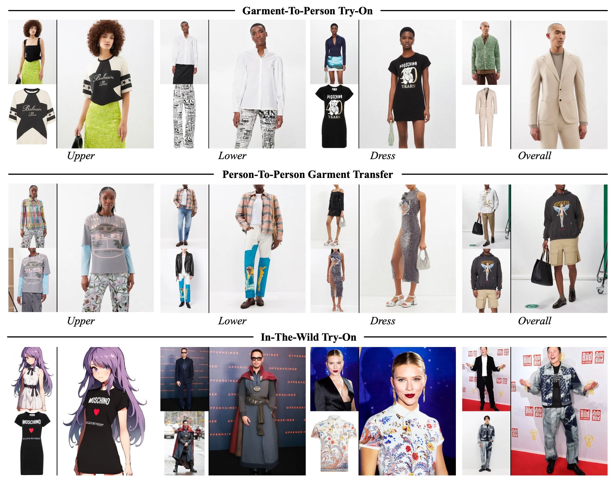

# AI-Stylist: Advanced Virtual Try-On with Diffusion Models

AI-Stylist is a high-performance, lightweight virtual try-on system powered by Diffusion Models. Developed as a comprehensive college project, it focuses on efficiency, accessibility, and high-quality visual synthesis.

<div align="center">
  
</div>

## Project Overview

AI-Stylist simplifies the virtual try-on process by using a concatenation-based approach with Latent Diffusion Models. Our implementation achieves state-of-the-art results while maintaining a low computational footprint, making it suitable for consumer-grade hardware.

### Key Features
- **🚀 Efficient Architecture**: Total 899M parameters, with only 49.5M trainable parameters for efficient adaptation.
- **🎨 High-Resolution Synthesis**: Supports 1024x768 resolution with less than 8GB of VRAM.
- **🛠️ Robust Preprocessing**: Integrated DensePose and SCHP for automatic human parsing and mask generation.
- **📱 Versatile Deployment**: Includes a user-friendly Gradio interface and ComfyUI workflow support.

---

## ⚙️ Installation

### 1. Environment Setup
We recommend using Conda to manage dependencies:

```bash
# Create and activate the environment
conda create -n ai-stylist python==3.9.0 -y
conda activate ai-stylist

# Install dependencies
pip install -r requirements.txt
```

### 2. Checkpoints
The model weights will be automatically downloaded during the first run of the Gradio app or inference script.

---

## 🚀 Usage

### Gradio Interface (Recommended)
Launch the interactive web UI to try on clothes with your own images:

```bash
python app.py \
    --output_dir "resource/demo/output" \
    --mixed_precision "bf16" \
    --allow_tf32
```
*Tip: Using `bf16` precision significantly reduces VRAM usage without compromising quality.*

### Bulk Inference
To run inference on standard datasets (VITON-HD or DressCode):

```bash
python inference.py \
    --dataset [vitonhd | dresscode] \
    --data_root_path <PATH_TO_DATASET> \
    --output_dir <PATH_TO_OUTPUT> \
    --mixed_precision "bf16" \
    --repaint
```

---

## 📊 Dataset Preparation

AI-Stylist supports the following dataset structures:

### VITON-HD / DressCode
Ensure your dataset follows this structure:
```text
├── Dataset_Root
│   ├── test
│   │   ├── image (Person images)
│   │   ├── cloth (Garment images)
│   │   └── agnostic-mask (Pre-generated masks)
```
For DressCode, use our preprocessing script for masks:
```bash
python preprocess_agnostic_mask.py --data_root_path <PATH_TO_DRESSCODE>
```

---

## 🎓 Technical Acknowledgements

This project builds upon the foundations laid by the open-source community:
- **Diffusers**: Core diffusion pipeline implementation.
- **Stable Diffusion v1.5**: Base inpainting model.
- **SCHP & DensePose**: For automated human parsing and pose estimation.
- **CatVTON**: Original research architecture and weights.

## 📄 License
This project is licensed under [Creative Commons BY-NC-SA 4.0](https://creativecommons.org/licenses/by-nc-sa/4.0/). It is intended for non-commercial, educational, and research purposes.

---
<p align="center">
  <i>Developed as part of a College Engineering Project.</i>
</p>
